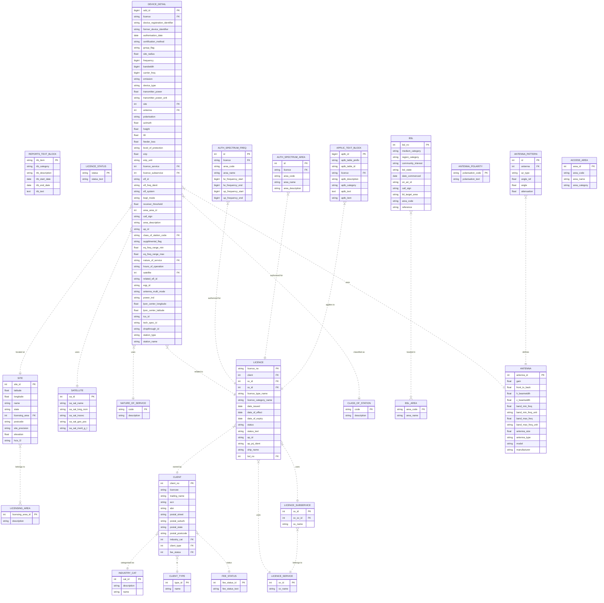

```mermaid
erDiagram
    SITE {
      int site_id PK
      float latitude
      float longitude
      string name
      string state
      int licensing_area FK
      string postcode
      string site_precision
      float elevation
      string hcis_l2
    }
    LICENSING_AREA {
      int licensing_area_id PK
      string description
    }
    SATELLITE {
      int sa_id PK
      string sa_sat_name
      string sa_sat_long_nom
      string sa_sat_incexc
      string sa_sat_geo_pos
      string sa_sat_merit_g_t
    }
    REPORTS_TEXT_BLOCK {
      string rtb_item PK
      string rtb_category
      string rtb_description
      date rtb_start_date
      date rtb_end_date
      text rtb_text
    }
    NATURE_OF_SERVICE {
      string code PK
      string description
    }
    LICENCE {
      string licence_no PK
      int client FK
      int sv_id FK
      int ss_id FK
      string licence_type_name
      string licence_category_name
      date date_issued
      date date_of_effect
      date date_of_expiry
      string status
      string status_text
      string ap_id
      string ap_prj_ident
      string ship_name
      int bsl_no FK
    }
    LICENCE_SERVICE {
      int sv_id PK
      string sv_name
    }
    LICENCE_SUBSERVICE {
      int ss_id PK
      int sv_sv_id FK
      string ss_name
    }
    LICENCE_STATUS {
      string status PK
      string status_text
    }
    INDUSTRY_CAT {
      int cat_id PK
      string description
      string name
    }
    FEE_STATUS {
      int fee_status_id PK
      string fee_status_text
    }
    DEVICE_DETAIL {
      bigint sdd_id PK
      string licence FK
      string device_registration_identifier
      string former_device_identifier
      date authorisation_date
      string certification_method
      string group_flag
      float site_radius
      bigint frequency
      bigint bandwidth
      bigint carrier_freq
      string emission
      string device_type
      float transmitter_power
      string transmitter_power_unit
      int site FK
      int antenna FK
      string polarisation
      float azimuth
      float height
      float tilt
      float feeder_loss
      string level_of_protection
      float eirp
      string eirp_unit
      int licence_service FK
      int licence_subservice FK
      string efl_id
      string efl_freq_ident
      string efl_system
      string leqd_mode
      float receiver_threshold
      int area_area_id
      string call_sign
      string area_description
      string ap_id
      string class_of_station_code FK
      string supplimental_flag
      float eq_freq_range_min
      float eq_freq_range_max
      string nature_of_service FK
      string hours_of_operation
      int satellite FK
      string related_efl_id
      string eqp_id
      string antenna_multi_mode
      string power_ind
      float lpon_center_longitude
      float lpon_center_latitude
      string tcs_id
      string tech_spec_id
      string dropthrough_id
      string station_type
      string station_name
    }
    CLIENT {
      int client_no PK
      string licencee
      string trading_name
      string acn
      string abn
      string postal_street
      string postal_suburb
      string postal_state
      string postal_postcode
      int industry_cat FK
      int client_type FK
      int fee_status FK
    }
    CLIENT_TYPE {
      int type_id PK
      string name
    }
    CLASS_OF_STATION {
      string code PK
      string description
    }
    BSL {
      int bsl_no PK
      string medium_category
      string region_category
      string community_interest
      string bsl_state
      date date_commenced
      string on_air_id
      string call_sign
      string ibl_target_area
      string area_code
      string reference
    }
    BSL_AREA {
      string area_code PK
      string area_name
    }
    AUTH_SPECTRUM_FREQ {
      int id PK
      string licence FK
      string area_code
      string area_name
      bigint lw_frequency_start
      bigint lw_frequency_end
      bigint up_frequency_start
      bigint up_frequency_end
    }
    AUTH_SPECTRUM_AREA {
      int id PK
      string licence FK
      string area_code
      string area_name
      string area_description
    }
    APPLIC_TEXT_BLOCK {
      bigint aptb_id PK
      string aptb_table_prefix
      string aptb_table_id
      string licence FK
      string aptb_description
      string aptb_category
      text aptb_text
      string aptb_item
    }
    ANTENNA {
      int antenna_id PK
      float gain
      float front_to_back
      float h_beamwidth
      float v_beamwidth
      float band_min_freq
      string band_min_freq_unit
      float band_max_freq
      string band_max_freq_unit
      float antenna_size
      string antenna_type
      string model
      string manufacturer
    }
    ANTENNA_POLARITY {
      string polarisation_code PK
      string polarisation_text
    }
    ANTENNA_PATTERN {
      int id PK
      int antenna FK
      string az_type
      float angle_ref
      float angle
      float attenuation
    }
    ACCESS_AREA {
      int area_id PK
      string area_code
      string area_name
      string area_category
    }

    SITE }|..|{ LICENSING_AREA : "belongs to"
    LICENCE }|..|| CLIENT : "owned by"
    LICENCE }|..|| LICENCE_SERVICE : "uses"
    LICENCE }|..|| LICENCE_SUBSERVICE : "uses"
    LICENCE_SUBSERVICE }|..|| LICENCE_SERVICE : "belongs to"
    DEVICE_DETAIL }|..|| LICENCE : "related to"
    DEVICE_DETAIL }|..|| SITE : "located at"
    DEVICE_DETAIL }|..|| ANTENNA : "uses"
    DEVICE_DETAIL }|..|| CLASS_OF_STATION : "classified as"
    DEVICE_DETAIL }|..|| NATURE_OF_SERVICE : "uses"
    DEVICE_DETAIL }|..|| SATELLITE : "uses"
    CLIENT }|..|| INDUSTRY_CAT : "categorized as"
    CLIENT }|..|| CLIENT_TYPE : "is"
    CLIENT }|..|| FEE_STATUS : "status"
    BSL }|..|{ BSL_AREA : "located in"
    AUTH_SPECTRUM_FREQ }|..|| LICENCE : "authorized for"
    AUTH_SPECTRUM_AREA }|..|| LICENCE : "authorized for"
    APPLIC_TEXT_BLOCK }|..|| LICENCE : "applies to"
    ANTENNA_PATTERN }|..|| ANTENNA : "defines"

```
